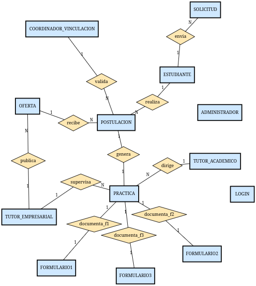
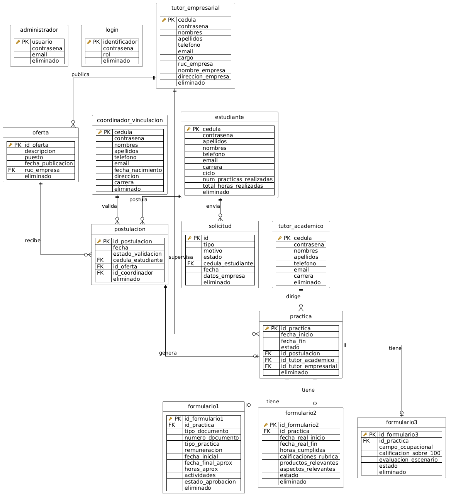

# Informe Académico: Diseño, Implementación y Arquitectura de la Base de Datos PostgreSQL

## 1. Introducción
El presente informe documenta el diseño, la implementación y la arquitectura de acceso a datos del "Sistema de Gestión de Prácticas Preprofesionales". La capa de persistencia se sustenta en el motor relacional **PostgreSQL**, elegido por su robustez, cumplimiento de las propiedades ACID y soporte nativo para tipos de datos avanzados. El objetivo de la base de datos es garantizar la integridad, consistencia y trazabilidad de la información relacionada con estudiantes, tutores, empresas, ofertas, postulaciones y el flujo completo de evaluación y aprobación de las prácticas preprofesionales.

## 2. Modelo Conceptual y Lógico
El modelo de datos se estructura en torno a las entidades fundamentales del dominio universitario y empresarial. 

### Justificación de Claves Naturales vs. Subrogadas
En el diseño relacional se ha adoptado un enfoque mixto y justificado para las claves primarias:
*   **Claves Naturales**: Se emplean en entidades maestro donde existe un identificador del mundo real que es inmutable y único. Por ejemplo, se utiliza la `cedula` (VARCHAR) para `estudiante`, `tutor_academico` y `coordinador_vinculacion`; y el `ruc_empresa` o `usuario` para otras entidades de negocio. Esto previene la duplicidad semántica y facilita la integración.
*   **Claves Subrogadas**: Se aplican en entidades transaccionales (como `oferta`, `postulacion`, `practica`, y formularios), donde la composición de una clave natural sería compleja y afectaría el rendimiento. Para estos casos, se delega la generación secuencial directamente al motor de la base de datos.





## 3. Implementación del Esquema Físico
La traducción del modelo lógico al esquema físico en PostgreSQL se encuentra definida en el archivo `esquema_postgresql.sql`. Destaca la rigurosidad en la definición de restricciones y tipos de datos para salvaguardar la integridad estructural.

*   **Identificadores Generados (Identity Columns):**
    En lugar del obsoleto tipo `SERIAL`, el sistema adopta el estándar SQL moderno `GENERATED ALWAYS AS IDENTITY`, lo que impide que la aplicación inserte valores arbitrarios en las claves primarias subrogadas:
    ```sql
    id_oferta INTEGER GENERATED ALWAYS AS IDENTITY PRIMARY KEY
    ```

*   **Restricciones de Integridad Referencial y Dominio (Constraints):**
    El esquema blinda la semántica de los datos mediante `FOREIGN KEY`, `UNIQUE` y `CHECK`:
    ```sql
    CONSTRAINT fk_postulacion_cedula_estudiante FOREIGN KEY (cedula_estudiante) REFERENCES practicas.estudiante(cedula),
    CHECK (estado_validacion IN ('Pendiente', 'Validada', 'Enviada', 'Aceptada', 'Rechazada')),
    email VARCHAR(120) NOT NULL UNIQUE
    ```

*   **Tipos de Datos Especializados:**
    *   **`JSONB`**: Se utiliza de manera estratégica para estructuras anidadas o dinámicas que no requieren normalización estricta (como actividades de formularios o rúbricas). Esto aprovecha la indexación GIN de PostgreSQL.
        ```sql
        actividades JSONB NOT NULL
        ```
    *   **`NUMERIC`**: Utilizado para calificaciones y remuneraciones, previniendo errores de precisión inherentes al estándar de coma flotante (`FLOAT`/`REAL`).
        ```sql
        calificacion_sobre_100 NUMERIC(5, 2) NOT NULL
        ```
    *   **`DATE`**: Usado de forma nativa para todas las fechas, delegando la validación del calendario al motor relacional:
        ```sql
        fecha_publicacion DATE
        ```

## 4. Arquitectura de Conexión y Patrones de Diseño
La conexión hacia PostgreSQL se canaliza a través de `psycopg2` orquestado por **SQLAlchemy 2.0**. La decisión arquitectónica más destacada es el estricto aislamiento de las capas empleando el patrón Repositorio (DAO) y un mapeo imperativo.

*   **Mapeo Imperativo y Separación de Responsabilidades:**
    A diferencia del patrón *Active Record* o el mapeo declarativo tradicional, las clases del dominio (`modelo/`) son objetos Python puros (POJOs/POCOs) que no heredan de ninguna clase base de la librería ORM. SQLAlchemy relaciona las tablas con los objetos en tiempo de ejecución:
    ```python
    # Mapeo imperativo: asocia cada tabla con su clase del modelo sin tocar la clase.
    mapper_registry.map_imperatively(Estudiante, tabla_estudiante)
    ```
*   **Gestor de Persistencia centralizado:**
    Toda abstracción de escritura y lectura es manejada por el `GestorPersistencia`, blindando a los controladores de cualquier sintaxis SQL:
    ```python
    def insertar(self, entidad, objeto):
        """Alta de una fila. Si la tabla tiene id generado por la base (IDENTITY),
        se recupera con RETURNING y se asigna de vuelta al objeto."""
        tabla, clase, _pk = self._entidad(entidad)
        # ...
    ```

## 5. Consultas y Vistas (Views) para Optimización
Para los listados de la interfaz gráfica y los reportes analíticos, el sistema aplica la buena práctica de delegar la complejidad relacional (múltiples uniones o `JOINs`) al motor PostgreSQL mediante Vistas (Views). 

*   La aplicación solo necesita consultar una "tabla plana", mejorando la mantenibilidad del código Python y el rendimiento:
    ```sql
    CREATE OR REPLACE VIEW practicas.vista_postulacion_detalle AS
    SELECT p.id_postulacion,
        p.estado_validacion,
        p.fecha,
        p.eliminado,
        p.cedula_estudiante,
        e.nombres AS est_nombres,
        e.apellidos AS est_apellidos,
        ...
        te.nombre_empresa
    FROM practicas.postulacion p
        JOIN practicas.estudiante e ON p.cedula_estudiante = e.cedula
        JOIN practicas.oferta o ON p.id_oferta = o.id_oferta
        JOIN practicas.tutor_empresarial te ON o.ruc_empresa = te.ruc_empresa;
    ```
*   El código del gestor consume estas vistas directamente mediante consultas dinámicas, delegando la resolución del plan de ejecución a PostgreSQL.

## 6. Transacciones y Seguridad
La seguridad informática y la consistencia transaccional son pilares del diseño.

*   **Transacciones ACID Atómicas:**
    Las operaciones complejas se envuelven en un manejador de contexto (`contextmanager`) para garantizar atomicidad (todo falla o todo tiene éxito):
    ```python
    @contextmanager
    def transaccion(self):
        """Agrupa varias escrituras en una sola transacción atómica..."""
        anterior = self._en_transaccion
        self._en_transaccion = True
        try:
            yield
            if not anterior:
                self._session.commit()
        except Exception:
            self._session.rollback()
            raise
    ```

*   **Borrado Lógico (Soft Delete):**
    Para cumplir normativas de auditoría, se evita la pérdida de información por cascada física (`ON DELETE CASCADE`). Se incorpora una columna de estado y un método dedicado para el borrado lógico:
    ```sql
    eliminado BOOLEAN NOT NULL DEFAULT FALSE
    ```
    ```python
    def marcar_eliminado(self, entidad, clave):
        """Eliminación lógica: marca la fila como eliminada."""
        # ...
        self._session.execute(
            update(tabla).where(tabla.c[pk] == clave).values(eliminado=True))
    ```

*   **Prevención de Inyección SQL:**
    Se emplean consultas parametrizadas internamente por SQLAlchemy, adaptando marcadores posicionales (`%s`) a parámetros seguros de tipo Bind, neutralizando vectores de inyección:
    ```python
    def _bindize(sql, params):
        """Traduce los marcadores posicionales '%s' (estilo psycopg2 que usan los
        repositorios) a parámetros nombrados ':_pN' para SQLAlchemy `text()`."""
    ```

*   **Criptografía y Hashing de Contraseñas:**
    Nunca se guardan credenciales en texto plano. A través de un decorador de tipos de SQLAlchemy (`TypeDecorator`), el sistema intercepta la escritura e inyecta un hash PBKDF2 salteado dinámicamente:
    ```python
    class ContrasenaHash(TypeDecorator):
        # ...
        def process_bind_param(self, value, dialect):
            if isinstance(value, str) and value and not es_hash(value):
                return hash_password(value)
            return value
    ```

## 7. Conclusiones
El diseño e implementación de la base de datos para el Sistema de Gestión de Prácticas Preprofesionales refleja un alto rigor en ingeniería de software. La arquitectura logra una profunda sinergia entre las capacidades avanzadas de PostgreSQL (JSONB, Identity Columns, Views) y el ecosistema Python. La estricta adopción del mapeo imperativo y el patrón Repositorio aseguran un acoplamiento nulo entre la lógica de negocio y la persistencia de datos. Finalmente, las sólidas garantías ACID y los mecanismos de seguridad (hashing, parametrización, borrado lógico) garantizan una aplicación estable, segura y escalable a nivel empresarial.
